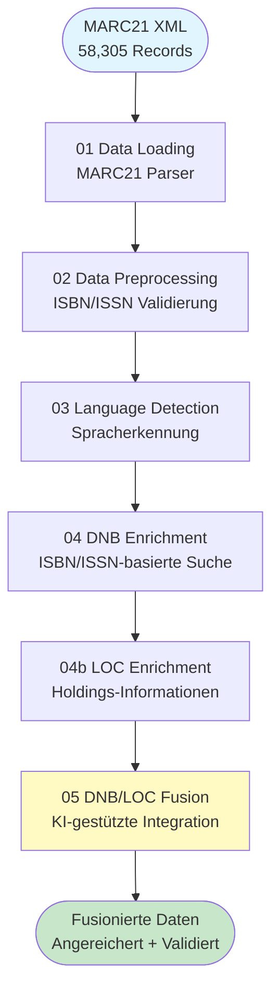
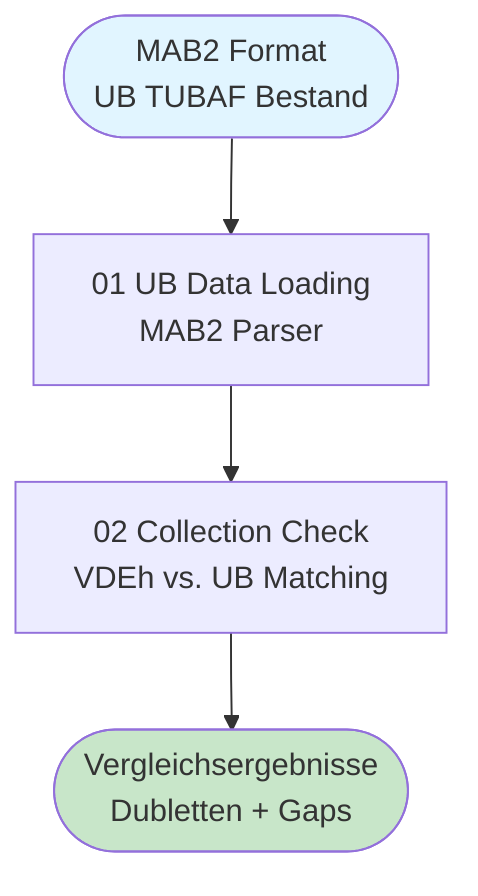
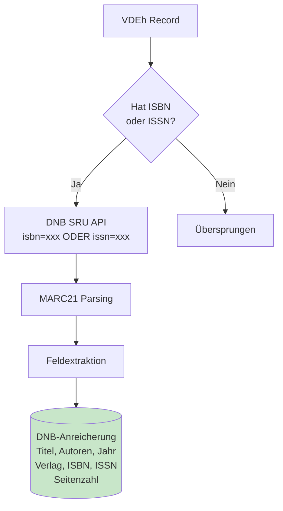
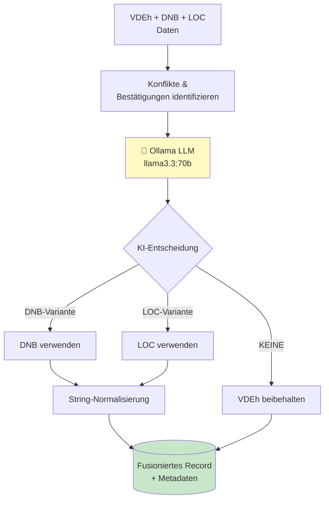

# Dual-Source Bibliothek Bestandsvergleich

**Version 2.4.0** | KI-gestützte bibliographische Datenanreicherung und -fusion

## 📋 Übersicht

Dieses Projekt führt einen systematischen Vergleich zwischen VDEh-Neuerwerbungen und dem UB TUBAF-Bestand durch. Der Fokus liegt auf der **intelligenten Datenanreicherung** über die Deutsche Nationalbibliothek (DNB) und Library of Congress (LOC) APIs sowie der **KI-gestützten Datenfusion** zur Qualitätsverbesserung bibliographischer Metadaten.

### Hauptmerkmale

- 🔍 **Multi-Source DNB/LOC-Anreicherung**: ISBN/ISSN-basiert (DNB) + Standortdaten (LOC)
- 🤖 **KI-gestützte Fusion**: Ollama LLM (llama3.3:70b) für intelligente Variantenauswahl
- 📚 **Dual-Source Bestandsvergleich**: VDEh-Neuerwerbungen vs. UB TUBAF-Bestand
- 📊 **Datenqualitätsanalyse**: Umfassende Qualitätsmetriken und Konfliktdetektion
- 📖 **Standort-Anreicherung**: LOC Holding-Informationen für identifizierte ISBNs
- 🔄 **Inkrementelle Verarbeitung**: Progressive Speicherung und Wiederaufnahme
- 🧹 **ISBN-Cleanup**: Automatische Erkennung und Bereinigung doppelter ISBNs

---

## 🏗️ Projektstruktur

```
analysis/
├── src/                          # Source Code Module
│   ├── parsers/                  # Parser für verschiedene Formate
│   │   ├── marc21_parser.py     # VDEh MARC21 Parser
│   │   ├── mab2_parser.py       # UB TUBAF MAB2 Parser
│   │   └── base_parser.py       # Basis-Parser-Klasse
│   ├── fusion/                   # KI-Fusion Engine
│   │   ├── fusion_engine.py     # Haupt-Fusion-Logik
│   │   ├── ollama_client.py     # Ollama LLM Client
│   │   └── utils.py             # Normalisierung & Vergleich
│   ├── comparison/               # Bestandsvergleich
│   │   └── matcher.py           # ISBN/Fuzzy Matching
│   ├── utils/                    # Utilities
│   │   └── notebook_utils.py    # Shared Notebook Setup
│   ├── dnb_api.py               # DNB SRU API Client
│   └── loc_api.py               # Library of Congress API Client
│
├── notebooks/                    # Jupyter Notebooks
│   ├── 01_vdeh_preprocessing/   # VDEh Verarbeitungspipeline
│   │   ├── 01_vdeh_data_loading.ipynb
│   │   ├── 02_vdeh_data_preprocessing.ipynb
│   │   ├── 03_vdeh_language_detection.ipynb
│   │   ├── 04_vdeh_data_enrichment.ipynb (DNB)
│   │   ├── 04b_vdeh_loc_enrichment.ipynb (LOC)
│   │   └── 05_vdeh_dnb_loc_fusion.ipynb
│   └── 02_ub_comparision/       # UB TUBAF & Vergleich
│       ├── 01_ub_data_loading.ipynb
│       └── 02_vdeh_ub_collection_check.ipynb
│
├── data/                        # Datenverzeichnisse
│   ├── vdeh/                    # VDEh Daten (MARC21 XML)
│   │   ├── raw/                 # Rohdaten (marcVDEH.xml)
│   │   └── processed/           # Verarbeitete Parquet-Dateien
│   ├── ub_tubaf/                # UB TUBAF Daten (MAB2)
│   │   ├── raw/                 # Rohdaten (027out.t)
│   │   └── processed/           # Verarbeitete Parquet-Dateien
│   └── comparison/              # Vergleichsergebnisse
│       ├── matches/
│       ├── gaps/
│       └── reports/
│
├── scripts/                     # Test- und Analyse-Scripts
│   ├── test_fusion_engine.py
│   ├── test_enrichment_logic.py
│   ├── generate_paper_stats.py
│   └── compare_dnb_strategies.py
│
├── docs/                        # Dokumentation
│   ├── PROJECT_STRUCTURE.md     # Detaillierte Projektstruktur
│   └── multi_source_fusion_plan.md
│
└── config.yaml                  # Zentrale Konfiguration
```

---

## 🔄 Verarbeitungspipeline

### VDEh Pipeline (notebooks/01_vdeh_preprocessing/)



### UB TUBAF Pipeline (notebooks/02_ub_comparision/)



---

## 📚 Detaillierte Verarbeitungsschritte

### 1. VDEh Data Loading (01_vdeh_data_loading.ipynb)

**Input:** `data/vdeh/raw/marcVDEH.xml` (MARC21 Format)
**Output:** `data/vdeh/processed/01_parsed_data.parquet`
**Records:** 58,305

**Extraktion:**
- Titel (MARC 245$a)
- Autoren (MARC 100/700)
- Jahr (MARC 260/264$c)
- Verlag (MARC 260/264$b)
- ISBN (MARC 020$a)
- ISSN (MARC 022$a)
- Seitenzahl (MARC 300$a)

### 2. Data Preprocessing (02_vdeh_data_preprocessing.ipynb)

**Output:** `data/vdeh/processed/02_preprocessed_data.parquet`

- ISBN/ISSN Strukturvalidierung
- Prüfziffernvalidierung
- Normalisierung (Entfernung von Bindestrichen)
- ISBN-Cleanup (Aufspalten konkatenierter ISBNs)
- Status-Klassifikation: `valid`, `invalid`, `missing`

### 3. Language Detection (03_vdeh_language_detection.ipynb)

**Output:** `data/vdeh/processed/03_language_detected_data.parquet`

- Titelbasierte Spracherkennung (langdetect)
- Confidence Scores
- Support für 11 Sprachen (DE, EN, FR, ES, IT, NL, PT, RU, PL, CS)

### 4. DNB Enrichment (04_vdeh_data_enrichment.ipynb)

**Output:** `data/vdeh/processed/04_dnb_enriched_data.parquet`

**Strategie:** ISBN/ISSN-basierte DNB SRU API Suche



**Erfolgsrate:** ~55% der Queries mit Treffern

### 4b. LOC Enrichment (04b_vdeh_loc_enrichment.ipynb)

**Output:** `data/vdeh/processed/04b_loc_enriched_data.parquet`

**Strategie:** Library of Congress Holdings API

- Standortinformationen für ISBNs
- Bibliotheks-Holdings weltweit
- Verfügbarkeitsdaten

### 5. DNB/LOC Fusion (05_vdeh_dnb_loc_fusion.ipynb)

**Output:** `data/vdeh/processed/05_fused_data.parquet`
**Engine:** `src/fusion/fusion_engine.py`



**KI-Entscheidungsregeln:**
1. Titel + Autoren dominieren (Jahr ±2 toleriert)
2. Bei Konflikten: DNB bevorzugen (höhere Datenqualität)
3. LOC für Standortinformationen
4. String-Normalisierung reduziert Konflikte um ~50%

### 6. UB TUBAF Data Loading (01_ub_data_loading.ipynb)

**Input:** `data/ub_tubaf/raw/027out.t` (MAB2 Format)
**Output:** `data/ub_tubaf/processed/01_ub_parsed_data.parquet`

**Parser:** `src/parsers/mab2_parser.py`

**Extraktion:**
- Titel (MAB 331)
- Autoren (MAB 100/104)
- Jahr (MAB 425)
- ISBN (MAB 540)
- ISSN (MAB 542)

### 7. VDEh vs. UB Collection Check (02_vdeh_ub_collection_check.ipynb)

**Output:** `data/comparison/vdeh_ub_comparison.parquet`

**Matching-Strategien:**
1. **ISBN Exact Match** - Exakte ISBN-Übereinstimmung
2. **ISBN Normalized Match** - Normalisierte ISBN
3. **Title Fuzzy Match** - Ähnlichkeitsbasiert (≥85%)
4. **Author-Title Combo** - Kombinierte Matching-Strategie

**Ergebnis:**
- Dubletten zwischen VDEh und UB TUBAF
- Gap-Analysis (einzigartige Records)
- Matching-Qualitätsmetriken

---

## 📊 Datenquellen

| Quelle | Format | Records | Beschreibung |
|--------|--------|---------|--------------|
| **VDEh** | MARC21 XML | 58,305 | Neuerwerbungen VDEh Bibliotheken |
| **UB TUBAF** | MAB2 | TBD | Bestand UB TU Bergakademie Freiberg |
| **DNB** | MARC21 (via SRU) | API | Deutsche Nationalbibliothek |
| **LOC** | JSON (via API) | API | Library of Congress Holdings |

### VDEh Metadaten-Vollständigkeit

| Feld | Vollständigkeit | Quelle |
|------|----------------|--------|
| **Titel** | 99.9% (58,252) | MARC 245$a |
| **Autoren** | 32.1% (18,740) | MARC 100/700 |
| **Jahr** | ~95% | MARC 260/264$c |
| **ISBN** | 18.2% (10,586) | MARC 020$a |
| **ISSN** | 1.2% (719) | MARC 022$a |
| **Seitenzahl** | 49.9% (29,080) | MARC 300$a |

**Herausforderung:** Niedrige ISBN/ISSN-Abdeckung → DNB/LOC Enrichment essentiell

---

## 🔧 Setup & Installation

### 1. Voraussetzungen

- Python 3.10+
- Poetry (Dependency Management)
- Ollama (für KI-Fusion)

### 2. Installation

```bash
# Repository klonen
git clone <repo-url>
cd analysis

# Dependencies installieren
poetry install

# Ollama starten (für Fusion)
ollama pull llama3.3:70b
ollama serve
```

### 3. Konfiguration

Zentrale Konfiguration in `config.yaml`:

```yaml
# Datenquellen
data_sources:
  vdeh:
    path: "data/vdeh/raw/marcVDEH.xml"
    parser_class: "MARC21Parser"

  ub_tubaf:
    path: "data/ub_tubaf/raw/027out.t"
    parser_class: "MAB2Parser"

# API-Konfiguration
dnb_api:
  base_url: "https://services.dnb.de/sru/dnb"
  rate_limit: 0.5  # Sekunden zwischen Requests

loc_api:
  base_url: "https://www.loc.gov"
  timeout: 30

# Fusion-Einstellungen
fusion:
  ollama_model: "llama3.3:70b"
  confidence_threshold: 0.7
```

---

## 📈 Verwendung

### Komplette VDEh Pipeline

```bash
cd notebooks/01_vdeh_preprocessing

# Schritt für Schritt
poetry run jupyter notebook 01_vdeh_data_loading.ipynb
poetry run jupyter notebook 02_vdeh_data_preprocessing.ipynb
poetry run jupyter notebook 03_vdeh_language_detection.ipynb
poetry run jupyter notebook 04_vdeh_data_enrichment.ipynb
poetry run jupyter notebook 04b_vdeh_loc_enrichment.ipynb
poetry run jupyter notebook 05_vdeh_dnb_loc_fusion.ipynb
```

### UB TUBAF Pipeline & Vergleich

```bash
cd notebooks/02_ub_comparision

poetry run jupyter notebook 01_ub_data_loading.ipynb
poetry run jupyter notebook 02_vdeh_ub_collection_check.ipynb
```

### Batch-Verarbeitung mit Papermill

```bash
# Automatisierte Notebook-Ausführung
poetry run papermill notebooks/01_vdeh_preprocessing/01_vdeh_data_loading.ipynb \
  output/01_executed.ipynb \
  -p max_records 1000
```

---

## 🔍 Test-Scripts

### Fusion Engine Testing

```bash
# Test der KI-Fusion-Logik
python scripts/test_fusion_engine.py

# Test der Anreicherungs-Logik
python scripts/test_enrichment_logic.py

# ISBN-Fusion-Test
python scripts/test_isbn_fusion.py

# Real-World Fusion Test
python scripts/test_real_fusion.py
```

### DNB-Strategien-Vergleich

```bash
# Vergleich verschiedener DNB-Suchstrategien
python scripts/compare_dnb_strategies.py
```

### Paper-Statistiken

```bash
# Generierung von Statistiken für wissenschaftliche Publikation
python scripts/generate_paper_stats.py
```

---

## 📊 Qualitätsmetriken

### DNB Enrichment Erfolgsrate

| Strategie | Queries | Treffer | Rate |
|-----------|---------|---------|------|
| ISBN/ISSN-basiert | ~11,000 | ~6,200 | 55% |

### Fusion Qualität (Testdaten)

| Metrik | Wert |
|--------|------|
| Akzeptierte Fusion | ~45% |
| Verworfene Matches | ~55% |
| Konflikt-Rate (nach Normalisierung) | ~29% |
| DNB-Variante bevorzugt | ~98% |

### Informationsgewinn durch Enrichment

| Feld | Vorher | Nachher (geschätzt) | Gewinn |
|------|--------|---------------------|--------|
| **ISBN** | ~10,600 (18%) | ~14,000 (24%) | **+33%** |
| **ISSN** | ~700 (1.2%) | ~800 (1.4%) | **+15%** |
| **Autoren** | ~18,700 (32%) | ~18,800 (32%) | **+0.5%** |
| **Verlag** | ~31,000 (53%) | ~31,200 (53%) | **+0.6%** |

---

## 🛠️ Technische Details

### Dependencies (Poetry)

```toml
[tool.poetry.dependencies]
python = "^3.10"
pandas = "^2.0.0"
lxml = "^6.0.2"
pymarc = "^5.3.1"
requests = "^2.31.0"
langdetect = "^1.0.9"
ollama = "^0.3.0"
rapidfuzz = "^3.14.3"
tqdm = "^4.66.0"
pyyaml = "^6.0.0"
jupyter = "^1.0.0"
matplotlib = "^3.7.0"
seaborn = "^0.12.0"
```

### Parser-Module

**MARC21Parser** (`src/parsers/marc21_parser.py`)
- Unterstützt MARC21 XML
- Feldextraktion via pymarc
- Automatisches ISBN-Cleanup

**MAB2Parser** (`src/parsers/mab2_parser.py`)
- Unterstützt MAB2 Format (Latin-1)
- Record-basiertes Parsing
- Feldmapping zu standardisiertem Schema

### API Clients

**DNB API** (`src/dnb_api.py`)
- SRU-Interface (Search/Retrieve via URL)
- MARC21 Response Parsing
- Rate Limiting & Retry-Logik

**LOC API** (`src/loc_api.py`)
- Holdings API
- JSON Response Parsing
- Standortinformationen

### Fusion Engine

**FusionEngine** (`src/fusion/fusion_engine.py`)
- Ollama LLM Integration
- Konflikt-Detektion
- String-Normalisierung
- Intelligente Variantenauswahl

---

## 📖 Dokumentation

- **Projektstruktur:** [docs/PROJECT_STRUCTURE.md](docs/PROJECT_STRUCTURE.md)
- **Fusion-Planung:** [docs/multi_source_fusion_plan.md](docs/multi_source_fusion_plan.md)
- **Konfiguration:** [config.yaml](config.yaml)

---

## 🆕 Changelog

### Version 2.4.0 (aktuell)

- ✅ UB TUBAF MAB2-Parser implementiert
- ✅ VDEh vs. UB Bestandsvergleich
- ✅ LOC Holdings API Integration
- ✅ DNB/LOC Fusion Pipeline

### Version 2.3.0 (2025-12-30)

- ⚠️ Report-Generator entfernt (Commit 39fd638)
- ✅ Vollständige Projektstruktur-Bereinigung

### Version 2.2.0 (2025-12-12)

- ✅ ISBN-Cleanup (automatisches Aufspalten konkatenierter ISBNs)
- ✅ Seitenzahlen-Extraktion (MARC 300$a)
- ✅ Enhanced DNB Search Strategy

### Version 2.1.0

- ✅ Titel/Jahr DNB-Strategie
- ✅ Similarity-Filter (70% Threshold)
- ✅ Pages-Tracking

### Version 2.0.0

- ✅ KI-gestützte Fusion (Ollama)
- ✅ Triple-Strategy DNB (ISBN/ISSN + Titel/Autor + Titel/Jahr)
- ✅ MARC21 Parser (von MAB migriert)

---

## 🤝 Autoren

**Data Analysis Team**
TU Bergakademie Freiberg

Kontakt: sebastian.zug@informatik.tu-freiberg.de

---

## 📄 Lizenz

Dieses Projekt ist für interne Forschungszwecke bestimmt.

---

## 🔗 Referenzen

- **DNB SRU API:** https://www.dnb.de/DE/Professionell/Metadatendienste/Datenbezug/SRU/sru_node.html
- **Library of Congress API:** https://www.loc.gov/apis/
- **MARC21:** https://www.loc.gov/marc/bibliographic/
- **MAB2:** https://www.dnb.de/DE/Professionell/Standardisierung/Formate/MAB/mab_node.html
- **Ollama:** https://ollama.ai/

---

**Erstellt:** 2024-10-31
**Letzte Aktualisierung:** 2026-01-02
**Version:** 2.4.0
