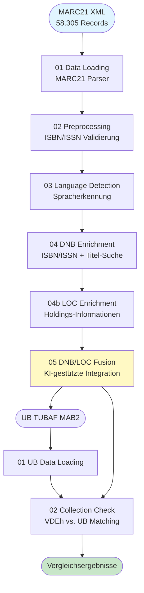
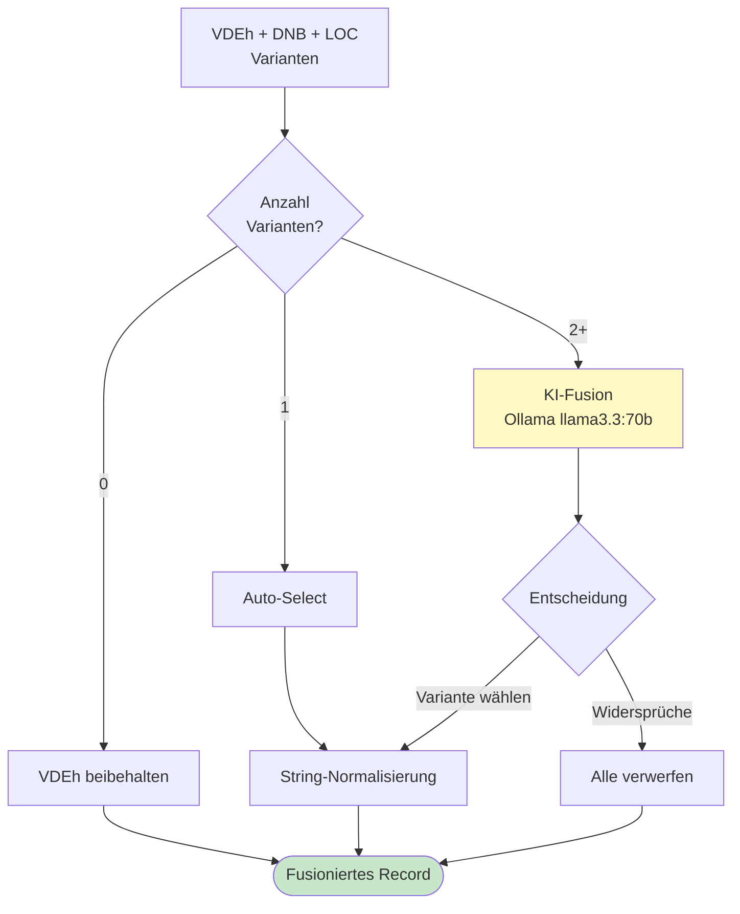

# Methodik & Verarbeitungspipeline

Dieses Dokument beschreibt das technische Vorgehen der VDEh-Bestandsanalyse. Für die Ergebnisse und Diskussion siehe den [Analysebericht (PDF)](paper/VDEH_Bestandsanalyse.pdf).

---

## Verarbeitungspipeline im Überblick

---

## Schritt 1: VDEh Data Loading

**Notebook:** `notebooks/01_vdeh_preprocessing/01_vdeh_data_loading.ipynb`
**Parser:** `src/parsers/marc21_parser.py`

Aus den MARC21-XML-Daten werden folgende bibliographische Felder extrahiert: Titel, Autoren, Erscheinungsjahr, Verlag, ISBN, ISSN und Seitenzahl. Das Feldmapping ist im Parser (`src/parsers/marc21_parser.py`) implementiert.

## Schritt 2: Preprocessing

**Notebook:** `notebooks/01_vdeh_preprocessing/02_vdeh_data_preprocessing.ipynb`

- ISBN/ISSN Strukturvalidierung und Prüfziffernvalidierung
- Normalisierung (Entfernung von Bindestrichen)
- ISBN-Cleanup: Aufspalten konkatenierter ISBNs (116 Fälle identifiziert)
- Status-Klassifikation: `valid`, `invalid`, `missing`

## Schritt 3: Spracherkennung

**Notebook:** `notebooks/01_vdeh_preprocessing/03_vdeh_language_detection.ipynb`

- Titelbasierte Spracherkennung via `langdetect`
- Ergebnis: 55,8% Deutsch, 28,3% Englisch (motiviert Wahl von DNB + LoC)

## Schritt 4: DNB-Anreicherung

**Notebook:** `notebooks/01_vdeh_preprocessing/04_vdeh_data_enrichment.ipynb`
**API-Client:** `src/dnb_api.py`

Dreistufige Suchstrategie über die DNB SRU API:

1. **ISBN/ISSN-Suche** - Direkte Identifier-basierte Abfrage
2. **Titel + Autor** - Vierstufige Fallback-Logik (exakter Titel+Autor -> Titelwörter+Autor -> exakter Titel -> Titelwörter)
3. **Titel + Jahr** - Mit Similarity-Validierung (70% Schwellenwert)

Rate Limit: 1s pro Anfrage. Inkrementelle Speicherung alle 50 Abfragen.

## Schritt 4b: LoC-Anreicherung

**Notebook:** `notebooks/01_vdeh_preprocessing/04b_vdeh_loc_enrichment.ipynb`
**API-Client:** `src/loc_api.py`

- Library of Congress Holdings API für englischsprachige Werke
- ISBN/ISSN-Suche und Titel+Autor-Suche
- Rate Limit: 10s pro Anfrage (konservativer wegen Server-Stabilität)

## Schritt 5: KI-gestützte Fusion

**Notebook:** `notebooks/01_vdeh_preprocessing/05_vdeh_dnb_loc_fusion.ipynb`
**Engine:** `src/fusion/fusion_engine.py`

Bei mehreren Anreicherungsvarianten entscheidet ein lokal betriebenes LLM (Ollama llama3.3:70b) über die finale Auswahl:

**Entscheidungslogik:**
- Titel und Autoren als dominierende Kriterien
- Jahresabweichungen von ±2 Jahren toleriert
- ID-basierte Treffer bevorzugt
- Konservative Strategie bei Widersprüchen (Verwerfung)
- String-Normalisierung reduziert Konflikt-Rate von 58% auf 29%

## Schritt 6: UB TUBAF Data Loading

**Notebook:** `notebooks/02_ub_comparision/01_ub_data_loading.ipynb`
**Parser:** `src/parsers/mab2_parser.py`

Aus den MAB2-Daten (Latin-1 Encoding) werden die gleichen Kernfelder extrahiert: Titel, Autoren, Erscheinungsjahr, ISBN und ISSN. Das Feldmapping ist im Parser (`src/parsers/mab2_parser.py`) implementiert.

## Schritt 7: Bestandsvergleich

**Notebook:** `notebooks/02_ub_comparision/02_vdeh_ub_collection_check.ipynb`
**Matcher:** `src/comparison/matcher.py`

Mehrstufiger Matching-Algorithmus:

1. **ISBN Exact Match** - Höchste Konfidenz
2. **ISBN Normalized Match** - Ohne Bindestriche
3. **Title Fuzzy Match** - Ähnlichkeit ≥85%
4. **Author+Title Combo** - Gewichtete Ähnlichkeit (Titel 60%, Autor 40%) ≥80%

---

## Technische Abhängigkeiten

| Paket | Zweck |
|-------|-------|
| pandas | Datenverarbeitung |
| pymarc | MARC21-Parsing |
| lxml | XML-Verarbeitung |
| langdetect | Spracherkennung |
| ollama | LLM-Integration |
| rapidfuzz | Fuzzy-Matching |
| requests | API-Abfragen |

Vollständige Dependencies in `pyproject.toml` (Poetry).

---

## Referenzen

- **DNB SRU API:** https://www.dnb.de/DE/Professionell/Metadatendienste/Datenbezug/SRU/sru_node.html
- **Library of Congress API:** https://www.loc.gov/apis/
- **MARC21 Standard:** https://www.loc.gov/marc/bibliographic/
- **MAB2 Format:** https://www.dnb.de/DE/Professionell/Standardisierung/Formate/MAB/mab_node.html
