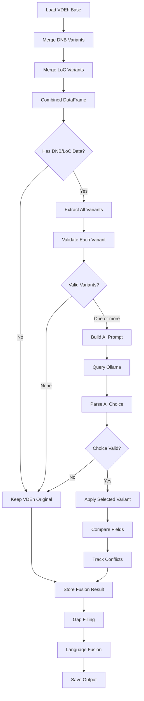

# Multi-Source Data Fusion Implementation Plan
**VDEh + DNB + LoC Integration**

Version: 1.0
Date: 2025-12-28
Status: PLANNING

---

## 📋 Executive Summary

This document outlines the implementation plan for extending the existing 2-source fusion (VDEh + DNB) to a 3-source fusion (VDEh + DNB + LoC). The goal is to leverage all three bibliographic data sources to create the highest-quality, most complete metadata records possible.

**Key Decisions:**
- ✅ Create new notebook: `05_multi_source_fusion.ipynb`
- ✅ Keep old notebook `05_vdeh_data_fusion.ipynb` as reference
- ✅ Include ALL LoC variants (ID, TA, TY) - even low-success TY variant
- ✅ Use language-based prioritization (DNB for German, LoC for English)
- ✅ Hardcode for 3 sources (VDEh + DNB + LoC) - no generic multi-source architecture

---

## 🎯 Goals

1. **Maximize Data Completeness**: Use all three sources to fill gaps in VDEh metadata
2. **Intelligent Conflict Resolution**: AI-based decision making when sources disagree
3. **Full Traceability**: Track which source provided each field
4. **Language-Aware Prioritization**: DNB for German works, LoC for English works
5. **Maintain Backward Compatibility**: Don't break existing pipeline stages

---

## 📊 Current State Analysis

### Available Data Sources

| Source | Records with Data | Coverage | Variants |
|--------|------------------|----------|----------|
| **VDEh** | 58,305 (100%) | Baseline | Original catalog data |
| **DNB** | 13,675 (23.4%) | All languages | ID (5,855), TA (6,697), TY (1,123) |
| **LoC** | ~1,650 (2.8%) | English only | ID (797), TA (853), TY (35) |

### Data Files

1. **VDEh Base**: `data/vdeh/processed/03_language_enriched_data.parquet`
2. **DNB Enriched**: `data/vdeh/processed/04_dnb_enriched_data.parquet` (contains DNB variants)
3. **LoC Enriched**: `data/vdeh/processed/04b_loc_enriched_data.parquet` (contains LoC variants)

### Current Fusion Architecture

**Existing** (05_vdeh_data_fusion.ipynb):
- Sources: VDEh + DNB
- Variants: 2 (DNB-ID, DNB-TA)
- AI Decision: Choose A (DNB-ID) or B (DNB-TA) or KEINE
- Output: `05_fused_data.parquet`

**Target** (05_multi_source_fusion.ipynb):
- Sources: VDEh + DNB + LoC
- Variants: 6 (DNB-ID, DNB-TA, DNB-TY, LoC-ID, LoC-TA, LoC-TY)
- AI Decision: Choose A/B/C/D/E/F or KEINE
- Output: `05_multi_source_fused_data.parquet`

---

## 🏗️ Implementation Architecture

### Phase 1: Data Preparation

**Input Data Merge**
```
Load VDEh base (03_language_enriched_data.parquet)
  ↓
Merge DNB variants (04_dnb_enriched_data.parquet)
  ↓
Merge LoC variants (04b_loc_enriched_data.parquet)
  ↓
Combined DataFrame with all variants
```

**Column Mapping**:

| Field | VDEh | DNB-ID | DNB-TA | DNB-TY | LoC-ID | LoC-TA | LoC-TY |
|-------|------|--------|--------|--------|--------|--------|--------|
| Title | `title` | `dnb_title` | `dnb_title_ta` | `dnb_title_ty` | `loc_title` | `loc_title_ta` | `loc_title_ty` |
| Authors | `authors_str` | `dnb_authors` | `dnb_authors_ta` | `dnb_authors_ty` | `loc_authors` | `loc_authors_ta` | `loc_authors_ty` |
| Year | `year` | `dnb_year` | `dnb_year_ta` | `dnb_year_ty` | `loc_year` | `loc_year_ta` | `loc_year_ty` |
| Publisher | `publisher` | `dnb_publisher` | `dnb_publisher_ta` | `dnb_publisher_ty` | `loc_publisher` | `loc_publisher_ta` | `loc_publisher_ty` |
| ISBN | `isbn` | `dnb_isbn` | `dnb_isbn_ta` | `dnb_isbn_ty` | `loc_isbn` | `loc_isbn_ta` | `loc_isbn_ty` |
| ISSN | `issn` | `dnb_issn` | `dnb_issn_ta` | `dnb_issn_ty` | `loc_issn` | `loc_issn_ta` | `loc_issn_ty` |
| Pages | `pages` | `dnb_pages` | - | - | `loc_pages` | `loc_pages_ta` | `loc_pages_ty` |

### Phase 2: FusionEngine Extension

**Extend `src/fusion/fusion_engine.py`**

#### 2.1 Variant Extraction

**Current** (lines 391-419):
```python
# Extract DNB variants only
dnb_id_variant = {...}  # from dnb_title, dnb_authors, etc.
dnb_ta_variant = {...}  # from dnb_title_ta, dnb_authors_ta, etc.
```

**New**:
```python
# Extract all 6 variants
variants = {
    'A': extract_dnb_id_variant(row),      # DNB-ID
    'B': extract_dnb_ta_variant(row),      # DNB-TA
    'C': extract_dnb_ty_variant(row),      # DNB-TY
    'D': extract_loc_id_variant(row),      # LoC-ID
    'E': extract_loc_ta_variant(row),      # LoC-TA
    'F': extract_loc_ty_variant(row),      # LoC-TY
}
```

**Validation for each variant**:
- Title similarity >= 0.5 (or 0.7 for TY variants)
- Year tolerance: ±2 years
- Pages difference: <20%

#### 2.2 AI Prompt Enhancement

**Current Prompt** (2-source):
```
You have the following bibliographic data variants:
- Original (VDEh): {...}
- DNB ID-Variante (A): {...}
- DNB Titel/Autor-Variante (B): {...}

Please choose: A, B, or KEINE
```

**New Prompt** (3-source):
```
You have the following bibliographic data variants:
- Original (VDEh): {title, authors, year, publisher}
- DNB ID-Variante (A): {...}
- DNB Titel/Autor-Variante (B): {...}
- DNB Titel/Jahr-Variante (C): {...}
- LoC ID-Variante (D): {...}
- LoC Titel/Autor-Variante (E): {...}
- LoC Titel/Jahr-Variante (F): {...}

Language-based prioritization:
- For German works (de/ger): Prefer DNB variants (A > B > C)
- For English works (en/eng): Prefer LoC variants (D > E > F)
- ID-based variants (A, D) are more reliable than TA/TY variants

Please choose: A, B, C, D, E, F, or KEINE
Return format: CHOICE|reasoning
```

**Prompt Template** (fusion_engine.py, ~line 266):
```python
def _build_multi_source_prompt(self, vdeh_data, variants, language):
    """
    Build AI prompt for 3-source fusion.

    Args:
        vdeh_data: dict with VDEh fields
        variants: dict with keys A-F containing variant data
        language: detected language (for prioritization hints)

    Returns:
        str: Formatted prompt for Ollama
    """
    prompt = f"""You are a bibliographic data expert. Compare the following variants and select the most accurate and complete one.

**Original VDEh Data:**
- Title: {vdeh_data['title']}
- Authors: {vdeh_data['authors']}
- Year: {vdeh_data['year']}
- Publisher: {vdeh_data['publisher']}

**Available Variants:**
"""

    # Add DNB variants
    if variants.get('A'):
        prompt += f"\n**A - DNB ID-Variante** (ISBN/ISSN-based, highest quality):\n"
        prompt += self._format_variant(variants['A'])

    if variants.get('B'):
        prompt += f"\n**B - DNB Titel/Autor-Variante**:\n"
        prompt += self._format_variant(variants['B'])

    if variants.get('C'):
        prompt += f"\n**C - DNB Titel/Jahr-Variante** (lower quality, gap-filling only):\n"
        prompt += self._format_variant(variants['C'])

    # Add LoC variants
    if variants.get('D'):
        prompt += f"\n**D - LoC ID-Variante** (ISBN/ISSN-based, highest quality):\n"
        prompt += self._format_variant(variants['D'])

    if variants.get('E'):
        prompt += f"\n**E - LoC Titel/Autor-Variante**:\n"
        prompt += self._format_variant(variants['E'])

    if variants.get('F'):
        prompt += f"\n**F - LoC Titel/Jahr-Variante** (very low success rate, gap-filling only):\n"
        prompt += self._format_variant(variants['F'])

    # Language-based prioritization hint
    prompt += f"\n\n**Language Context:** {language}\n"
    if language in ['de', 'ger', 'deu']:
        prompt += "→ Prefer DNB variants (A > B > C) for German works\n"
    elif language in ['en', 'eng']:
        prompt += "→ Prefer LoC variants (D > E > F) for English works\n"
    else:
        prompt += "→ Prefer ID-based variants (A, D) regardless of source\n"

    prompt += """
**Decision Rules:**
1. ID-based variants (A, D) are more reliable than Title/Author (B, E) or Title/Year (C, F)
2. If sources agree, choose the ID-based variant
3. If DNB and LoC conflict, use language preference
4. If all variants have quality issues, return KEINE to keep VDEh original

**Your task:** Choose A, B, C, D, E, F, or KEINE.
**Return format:** CHOICE|your reasoning in one sentence

Example: A|DNB ID-Variante hat vollständige und korrekte Metadaten, stimmt mit LoC überein.
"""

    return prompt
```

#### 2.3 Response Parsing

**Extend** (fusion_engine.py, ~line 302):
```python
def _parse_ai_response(self, response_text):
    """Parse AI response for 6-variant choice."""

    # Clean response
    response = response_text.strip().upper()

    # Extract choice (A, B, C, D, E, F, or KEINE)
    for choice in ['A', 'B', 'C', 'D', 'E', 'F', 'KEINE']:
        if response.startswith(choice):
            # Extract reasoning after pipe
            if '|' in response:
                reasoning = response.split('|', 1)[1].strip()
            else:
                reasoning = response[len(choice):].strip()

            return choice, reasoning

    # Fallback: no clear choice
    return 'KEINE', 'AI response unclear or ambiguous'
```

#### 2.4 Variant Application

**Mapping** (fusion_engine.py, ~line 572):
```python
VARIANT_MAPPING = {
    'A': 'dnb_id',
    'B': 'dnb_title_author',
    'C': 'dnb_title_year',
    'D': 'loc_id',
    'E': 'loc_title_author',
    'F': 'loc_title_year',
    'KEINE': None
}

def _apply_variant_choice(self, row, choice, vdeh_data):
    """Apply the selected variant to create fused record."""

    variant_source = VARIANT_MAPPING.get(choice)

    if variant_source is None:
        # Keep VDEh original
        return self._create_fusion_result(vdeh_data, 'vdeh')

    # Map to column names
    if choice == 'A':
        variant_data = self._extract_dnb_id_variant(row)
    elif choice == 'B':
        variant_data = self._extract_dnb_ta_variant(row)
    elif choice == 'C':
        variant_data = self._extract_dnb_ty_variant(row)
    elif choice == 'D':
        variant_data = self._extract_loc_id_variant(row)
    elif choice == 'E':
        variant_data = self._extract_loc_ta_variant(row)
    elif choice == 'F':
        variant_data = self._extract_loc_ty_variant(row)

    # Merge variant with VDEh (variant takes priority for non-empty fields)
    fused_data = self._merge_with_vdeh(vdeh_data, variant_data, variant_source)

    return fused_data
```

#### 2.5 Helper Functions

**Add new extraction functions**:

```python
def _extract_loc_id_variant(self, row):
    """Extract LoC ID-based variant from row."""
    return {
        'title': row.get('loc_title'),
        'authors': row.get('loc_authors'),
        'year': row.get('loc_year'),
        'publisher': row.get('loc_publisher'),
        'isbn': row.get('loc_isbn'),
        'issn': row.get('loc_issn'),
        'pages': row.get('loc_pages')
    }

def _extract_loc_ta_variant(self, row):
    """Extract LoC Title/Author variant from row."""
    return {
        'title': row.get('loc_title_ta'),
        'authors': row.get('loc_authors_ta'),
        'year': row.get('loc_year_ta'),
        'publisher': row.get('loc_publisher_ta'),
        'isbn': row.get('loc_isbn_ta'),
        'issn': row.get('loc_issn_ta'),
        'pages': row.get('loc_pages_ta')
    }

def _extract_loc_ty_variant(self, row):
    """Extract LoC Title/Year variant from row."""
    return {
        'title': row.get('loc_title_ty'),
        'authors': row.get('loc_authors_ty'),
        'year': row.get('loc_year_ty'),
        'publisher': row.get('loc_publisher_ty'),
        'isbn': row.get('loc_isbn_ty'),
        'issn': row.get('loc_issn_ty'),
        'pages': row.get('loc_pages_ty')
    }

def _extract_dnb_ty_variant(self, row):
    """Extract DNB Title/Year variant from row."""
    return {
        'title': row.get('dnb_title_ty'),
        'authors': row.get('dnb_authors_ty'),
        'year': row.get('dnb_year_ty'),
        'publisher': row.get('dnb_publisher_ty'),
        'isbn': row.get('dnb_isbn_ty'),
        'issn': row.get('dnb_issn_ty'),
        'pages': None  # DNB TY doesn't have pages
    }
```

### Phase 3: Notebook Creation

**New Notebook**: `notebooks/01_vdeh_preprocessing/05_multi_source_fusion.ipynb`

#### Structure:

1. **Setup & Configuration**
   - Project root detection
   - Config loading
   - Ollama client initialization

2. **Data Loading**
   ```python
   # Load VDEh base
   df_vdeh = pd.read_parquet('03_language_enriched_data.parquet')

   # Load DNB enriched (contains DNB variants)
   df_dnb = pd.read_parquet('04_dnb_enriched_data.parquet')

   # Load LoC enriched (contains LoC variants)
   df_loc = pd.read_parquet('04b_loc_enriched_data.parquet')

   # Merge all sources
   df_combined = df_vdeh.copy()
   df_combined = df_combined.join(df_dnb[dnb_columns], how='left')
   df_combined = df_combined.join(df_loc[loc_columns], how='left')
   ```

3. **Statistics Before Fusion**
   - Completeness analysis (title, authors, year, publisher)
   - Variant availability counts

4. **Fusion Execution**
   ```python
   fusion_engine = FusionEngine(
       ollama_client=ollama_client,
       variant_priority=['A', 'D', 'B', 'E', 'C', 'F']  # ID variants first
   )

   for idx, row in tqdm(df_combined.iterrows()):
       result = fusion_engine.merge_record(row)
       # Store results in DataFrame
   ```

5. **Gap Filling**
   - Fill missing ISBNs from DNB/LoC
   - Fill missing ISSNs from DNB/LoC
   - Fill missing authors/year/publisher from best available source

6. **Language Fusion**
   - MARC21 language (priority 1)
   - langdetect language (priority 2)
   - DNB language (priority 3)
   - LoC language (priority 4)

7. **Statistics After Fusion**
   - Completeness improvement
   - Source distribution
   - Conflict resolution stats

8. **Output**
   - Save: `05_multi_source_fused_data.parquet`
   - Metadata: `05_multi_source_metadata.json`

### Phase 4: Source Attribution

**Track source for each field**:

```python
fusion_result = {
    'title': '...',
    'title_source': 'dnb_id',  # or 'loc_id', 'dnb_title_author', 'vdeh', 'confirmed'

    'authors': '...',
    'authors_source': 'loc_title_author',

    'year': ...,
    'year_source': 'confirmed',  # DNB and LoC agree

    'publisher': '...',
    'publisher_source': 'vdeh',

    'isbn': '...',
    'isbn_source': 'loc_title_author_gap_fill',

    'fusion_conflicts': '{"title": {"vdeh": "...", "dnb": "...", "loc": "..."}}',
    'fusion_confirmations': '{"year": ["dnb_id", "loc_id"]}',
    'fusion_ai_reasoning': 'DNB ID-Variante gewählt wegen...',
    'fusion_selected_variant': 'A',  # A, B, C, D, E, F, or KEINE
    'fusion_dnb_match_rejected': False,
    'fusion_loc_match_rejected': False
}
```

---

## 🔄 Workflow



---

## 📈 Expected Improvements

### Completeness Gains

| Field | Before | After (Estimated) | Improvement |
|-------|--------|-------------------|-------------|
| Title | 99.9% | 99.95% | +0.05% |
| Authors | 30.3% | 32-35% | +2-5% |
| Year | 57.4% | 60-62% | +3-5% |
| Publisher | 41.0% | 44-47% | +3-6% |
| ISBN | 17.8% | 20-22% | +2-4% |

### Quality Improvements

1. **Conflict Resolution**: AI chooses best variant among 6 options (vs. 2 currently)
2. **Language-Specific**: German works get DNB data, English works get LoC data
3. **Redundancy**: If one source fails, 2 others available
4. **Validation**: Cross-source confirmation increases confidence

---

## 🧪 Testing Strategy

### Unit Tests

1. **Variant Extraction**
   - Test `_extract_loc_id_variant()` with real data
   - Test `_extract_loc_ta_variant()` with real data
   - Test `_extract_dnb_ty_variant()` with real data

2. **Prompt Generation**
   - Test `_build_multi_source_prompt()` with all 6 variants
   - Test with only DNB variants (no LoC)
   - Test with only LoC variants (no DNB)
   - Test with mixed variants

3. **Response Parsing**
   - Test `_parse_ai_response()` with choices A-F
   - Test with malformed responses
   - Test with KEINE choice

### Integration Tests

1. **Small Dataset Test**
   - Run fusion on 100 records with all variants
   - Verify source attribution
   - Check conflict tracking

2. **Language-Specific Test**
   - German records: Should prefer DNB
   - English records: Should prefer LoC
   - Mixed language: Should prefer ID variants

3. **Gap Filling Test**
   - Records with missing ISBN: Should get filled from DNB/LoC
   - Records with missing authors: Should get filled from best source

---

## 📋 Implementation Checklist

### Phase 1: FusionEngine Extension
- [ ] Add `_extract_loc_id_variant()` method
- [ ] Add `_extract_loc_ta_variant()` method
- [ ] Add `_extract_loc_ty_variant()` method
- [ ] Add `_extract_dnb_ty_variant()` method
- [ ] Update `_build_multi_source_prompt()` for 6 variants
- [ ] Update `_parse_ai_response()` for A-F choices
- [ ] Update `VARIANT_MAPPING` dictionary
- [ ] Add validation for all 6 variants
- [ ] Update `merge_record()` main logic

### Phase 2: Notebook Creation
- [ ] Create `05_multi_source_fusion.ipynb`
- [ ] Setup section (project root, config, Ollama)
- [ ] Data loading (VDEh + DNB + LoC merge)
- [ ] Statistics before fusion
- [ ] Fusion execution loop with progress tracking
- [ ] Gap filling logic (ISBN, ISSN, authors, year, publisher)
- [ ] Language fusion (MARC21 + langdetect + DNB + LoC)
- [ ] Statistics after fusion
- [ ] Output saving (parquet + metadata JSON)

### Phase 3: Testing
- [ ] Unit tests for variant extraction
- [ ] Unit tests for prompt generation
- [ ] Unit tests for response parsing
- [ ] Integration test with 100 records
- [ ] Language-specific test (German vs English)
- [ ] Gap filling test
- [ ] Full pipeline test with subset of data

### Phase 4: Documentation
- [ ] Update README with new notebook
- [ ] Document new fusion workflow
- [ ] Add examples of multi-source fusion
- [ ] Document source attribution format

---

## 🚧 Risks & Mitigations

| Risk | Impact | Mitigation |
|------|--------|------------|
| **Ollama timeout** | High | Existing retry logic + fallback model |
| **LoC TY variant noise** | Medium | Higher validation threshold (0.7 similarity) |
| **AI chooses wrong variant** | Medium | Manual review of sample, adjust prompt |
| **Source attribution errors** | Low | Unit tests, validation checks |
| **Memory usage spike** | Low | Incremental saving every 50 records |

---

## 📅 Estimated Effort

| Phase | Tasks | Estimated Time |
|-------|-------|----------------|
| **Phase 1: FusionEngine** | Add 4 extraction methods, update prompt, parsing | 2-3 hours |
| **Phase 2: Notebook** | Create notebook, implement fusion loop, gap filling | 3-4 hours |
| **Phase 3: Testing** | Unit tests, integration tests, validation | 2-3 hours |
| **Phase 4: Documentation** | Update docs, examples | 1 hour |
| **Total** | | **8-11 hours** |

---

## 🎯 Success Criteria

1. ✅ All 6 variants (DNB-ID, DNB-TA, DNB-TY, LoC-ID, LoC-TA, LoC-TY) are extracted correctly
2. ✅ AI can choose among A, B, C, D, E, F, or KEINE
3. ✅ Language-based prioritization works (DNB for German, LoC for English)
4. ✅ Source attribution is accurate for every field
5. ✅ Metadata completeness improves by 2-5% for authors, year, publisher
6. ✅ No regression in existing fusion quality
7. ✅ Full traceability: every field has a source marker

---

## 📝 Notes

- **Old notebook preservation**: `05_vdeh_data_fusion.ipynb` remains as reference for 2-source fusion
- **Backward compatibility**: Existing DNB-only fusion still works
- **Future extensibility**: While hardcoded for 3 sources, the pattern can be extended if needed
- **Variant priority**: ID > TA > TY, with language preference overlay

---

## 🔗 References

- Current FusionEngine: `src/fusion/fusion_engine.py`
- DNB Enrichment: `notebooks/01_vdeh_preprocessing/04_vdeh_data_enrichment.ipynb`
- LoC Enrichment: `notebooks/01_vdeh_preprocessing/04b_vdeh_loc_enrichment.ipynb`
- Old Fusion: `notebooks/01_vdeh_preprocessing/05_vdeh_data_fusion.ipynb`

---

**End of Implementation Plan**
