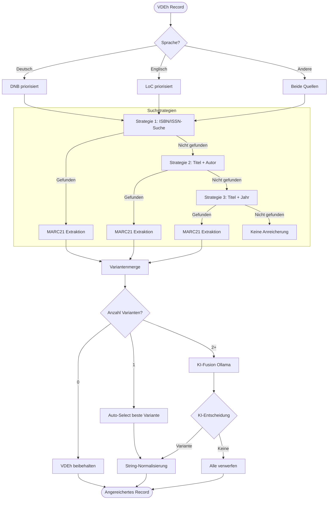

# Motivation

Der Bestand von 70.000 Büchern und 90.000 Zeitschriften der VDEh-Bibliothek ist 2020 an die Technische Bergakademie Freiberg übergegangen.[^vdeh-bestand] Ein kleiner Teil dieses Bestandes wurde bereits digitalisiert.[^vdeh-digital] Aus Sicht der Universitätsbibliothek Freiberg (UB) und der Expertinnen und Experten der Fakultät 4 besteht großes Interesse daran, den VDEh-Bestand vollständig zu digitalisieren, zugänglich zu machen und mit KI-Techniken zu erschließen. 

[^vdeh-bestand]: Webseite der UB Freiberg - [Link](https://tu-freiberg.de/ub/suchen-finden/sammlungen/vdeh-bestand)
[^vdeh-digital]: Webseite Sachsen Digital - [Link](https://sachsen.digital/sammlungen/bibliothek-des-vereins-deutscher-eisenhuettenleute-vdeh)

## Forschungsfragen

Die Sammlung ist gegenwärtig in etwa 4.000 Kartons gelagert. Um den Digitalisierungsaufwand realistisch einschätzen zu können, sind vorab zwei wesentliche Fragen zu klären.

| Forschungsfrage | Fragestellung | Begründung |
|-----------------|---------------|------------|
| **Frage 1: Bestandsüberschneidung** | Wie viele Bücher der VDEh-Sammlung sind bereits im Bestand der UB TU Bergakademie Freiberg vorhanden? | Dubletten bräuchten nicht übernommen zu werden, gleichzeitig könnte der Digitalisierungsaufwand durch die Eliminierung reduziert werden. |
| **Frage 2: Digitalisierungsaufwand** | Wie viele Seiten umfasst der VDEh-Bestand, der digitalisiert werden soll? | Um den Aufwand einer Gesamtdigitalisierung abzuschätzen, ist die Gesamtseitenzahl der zu digitalisierenden Bücher erforderlich. |

## Datengrundlage 

Für die Beantwortung der Fragen stehen folgende Metadatenquellen zur Verfügung:

- **VDEh-Bestand:** Metadaten von aus dem VDEh-Bestand existieren als MARC21 XML-Datei. Die letzte Aktualisierung der Daten erfolgte 9. November 2017.
- **UB Freiberg Katalog:** Die Metadaten der UB mit 518946 Einträgen standen als MAB2 Datei bereit. 

## Herausforderungen

Die Beantwortung beider Fragen wird durch **unvollständige und heterogene Metadaten** im VDEh-Bestand erschwert:

- **Fehlende ISBN-Nummern:** Nur 18,0% der Datensätze verfügen über eine ISBN
- **Fehlende Seitenzahlen:** Bei 51,8% der Bücher fehlen Seitenzahlangaben
- **Datenqualitätsprobleme:** Inkonsistente Formatierung und fehlerhafte Identifier

Diese Lücken erfordern eine **methodische Datenanreicherung** vor dem Bestandsabgleich.

# VDEh-Datenbestand: Ausgangssituation

## Bestandsübersicht

Der VDEh-Buchbestand umfasst **58.305 bibliographische Datensätze** im MARC21-Format, extrahiert aus XML-Katalogdaten.

**Grundlegende Vollständigkeit:**

| Metadatenfeld | Anzahl | Vollständigkeit |
|--------------|-------:|----------------:|
| Titel | 58.242 | 99,9% |
| Autor(en) | 58.305 | 100,0% |
| Erscheinungsjahr | 33.313 | 57,1% |
| ISBN | 10.507 | **18,0%** ⚠️ |
| ISSN | 710 | 1,2% |
| Seitenzahl | 28.132 | **48,2%** ⚠️ |

**Kritische Beobachtung:** Die geringe Abdeckung mit ISBN-Nummern (18,0%) und Seitenzahlen (48,2%) stellt ein erhebliches Hindernis für automatische Bestandsabgleiche dar.

## Sprachverteilung

Die fünf häufigsten Sprachen im VDEh-Bestand:

| Sprache | Anzahl | Anteil |
|---------|-------:|-------:|
| Deutsch (de) | 32.543 | 55,8% |
| Englisch (en) | 16.516 | 28,3% |
| Unbekannt (unknown) | 1.446 | 2,5% |
| Französisch (fr) | 929 | 1,6% |
| Italienisch (it) | 773 | 1,3% |

Die Sprachverteilung zeigt eine **Dominanz deutscher und englischer Literatur** (84,1%), was die Wahl von DNB (Deutsche Nationalbibliothek) und LoC (Library of Congress) als Anreicherungsquellen motiviert.

## Datenqualitätsprobleme

Eine detaillierte Analyse identifizierte erhebliche Qualitätsprobleme insbesondere bei der ISBN-Validierung und dem Seitenzahl-Format. Bei den ISBN-Nummern wurden 116 Fälle konkatenierter ISBNs festgestellt (z.B. `"978316148410097834567890123"`), 93 Fälle mit ungültigen Prüfziffern sowie diverse Formatierungsfehler. Darüber hinaus zeigten sich bei den Seitenzahl-Angaben inkonsistente Formate wie `"188 S. :"` oder `"XI, 137, A35, B21 S. :"`, die eine Regex-Extraktion zur Normalisierung erforderlich machen.

*Vor dem Hintergrund großer Lücken im Metadatenbestand sind **Datenanreicherungen** durch Abgleiche mit externen Katalogen unerlässlich, um die Forschungsfragen zu adressieren.*

# Datenanreicherung über DNB und LoC

## Motivation und Strategie

Die Anreicherung der VDEh-Bestandsdaten verfolgt drei zentrale Ziele: Erstens soll die Abdeckung mit ISBN- und ISSN-Nummern deutlich erhöht werden, da diese standardisierten Identifikatoren ein präzises Matching zwischen verschiedenen Bibliotheksbeständen ermöglichen. Zweitens dient die Anreicherung der Validierung bereits vorhandener Metadaten durch den Abgleich von Titel, Autor und Erscheinungsjahr mit autorisierten Quellen. Drittens werden fehlende Seitenzahlen ergänzt, die für eine fundierte Schätzung des Digitalisierungsaufwands unverzichtbar sind.

Für die Auswahl geeigneter Anreicherungsquellen orientiert sich die Strategie an der Sprachverteilung des VDEh-Bestands. Die Deutsche Nationalbibliothek (DNB) wird primär für deutschsprachige Literatur herangezogen, die mit 55,8% den Großteil des Bestands ausmacht. Für englischsprachige Werke, die 28,3% umfassen, dient die Library of Congress (LoC) als maßgebliche Referenz. Beide Quellen werden über ihre SRU-APIs (Search/Retrieve via URL) angebunden und liefern bibliografische Daten im standardisierten MARC21-Format.

## Methodisches Vorgehen

Die Anreicherung erfolgt, wie in nachfolgender Grafik gezeigt, mit einer dreistufigen Suchstrategie für LOC und DNB:

+ ID-basierte Suche (ISBN/ISSN)
+ Titel + Autor Suche mit vierstufiger Fallback-Logik
  1. Exakter Titel + Autor: `tit="Exact Title" AND per=Author`
  2. Titel-Wörter + Autor: `tit=Title Words AND per=Author`
  3. Exakter Titel: `tit="Exact Title"`
  4. Titel-Wörter: `tit=Title Words`

+ Titel + Jahr mit Similarity-Validierung
  1. Exakter Titel + Jahr: `tit="Exact Title" AND date=Year`
  2. Titel-Wörter + Jahr: `tit=Title Words AND date=Year`

Bei mehreren Anreicherungsvarianten (z.B. DNB-ID, DNB-TA, LoC-ID) entscheidet ein Large Language Model (LLM) über die finale Auswahl. Zum Einsatz kommt das lokal betriebene Modell Ollama llama3.3:70b, das neben den bibliografischen Kerndaten (Titel, Autor, Erscheinungsjahr) aus dem VDEh-Bestand und den jeweiligen Anreicherungsquellen auch eine strukturierte Konflikt- und Bestätigungsanalyse erhält. Die Entscheidungslogik priorisiert dabei Titel und Autoren als dominierende Kriterien, während Jahresabweichungen von ±2 Jahren toleriert werden. Bei mehreren gleichwertigen Varianten bevorzugt das Modell ID-basierte Treffer, während bei klaren Widersprüchen zwischen den Quellen eine konservative Strategie verfolgt wird und alle Varianten verworfen werden. Eine nachgelagerte String-Normalisierung reduziert die Konflikt-Rate nachweislich von 58% auf 29%.

*Abbildung: Ablauf der dreistufigen Anreicherungsstrategie mit sprachbasierter Quellenpriorisierung und KI-gestützter Variantenauswahl*

## Umsetzung

Die praktische Durchführung der Anreicherung erfolgte über parallele API-Abfragen an DNB und LoC mit konfigurierten Rate Limits zur Schonung der Server-Ressourcen. Für DNB wurde ein Rate Limit von 1 Sekunde pro Anfrage gewählt, während für LoC aufgrund geringerer Server-Stabilität ein konservativeres Limit von 10 Sekunden angesetzt wurde. Die Gesamtdauer der Anreicherung belief sich auf etwa 33 Stunden reine API-Abfragezeit, wobei 10.780 DNB-ISBN/ISSN-Abfragen (~3 Stunden), 17.488 DNB-Titel/Autor-Abfragen (~5 Stunden), 5.856 DNB-Titel/Jahr-Abfragen (~2 Stunden) sowie 3.785 LoC-ISBN/ISSN-Abfragen (~11 Stunden) und 4.770 LoC-Titel/Autor-Abfragen (~13 Stunden) durchgeführt wurden. Um Datenverlust bei Verbindungsabbrüchen zu vermeiden, wurden Zwischenergebnisse alle 50 Abfragen persistiert.

## Ergebnisse

### Anreicherungsgewinn nach Datenfeldern

Von den 58.305 VDEh-Datensätzen konnten 10.690 (18,3%) über die DNB und 1.323 (2,3%) über die LoC erfolgreich angereichert werden. Die folgende Tabelle zeigt, wie viele Datensätze durch die Anreicherung zusätzliche Informationen erhalten haben:

| Feld | VDEh-Bestand | Gewinn durch Anreicherung |
|------|-------------:|--------------------------:|
| Titel | 58.242 | 7 |
| Autor(en) | 58.305 | 0 |
| Erscheinungsjahr | 33.313 | 3.031 |
| ISBN | 10.507 | **4.338** |
| ISSN | 710 | **450** |
| Seitenzahl | 28.132 | **86** |

### Limitierungen und Verbesserungspotenzial

Die relativ niedrigen Gewinnzahlen bei der Titel+Autor-Suche trotz 10.690 erfolgreicher DNB-Anfragen lassen sich auf **strukturelle Unterschiede in der Titelerfassung** zurückführen. Während die ISBN-basierte Suche zuverlässig funktioniert, scheitert die Titel-basierte Suche häufig an systematischen Diskrepanzen zwischen VDEh- und DNB-Katalogisierung:

**Typische Probleme:**

1. **Untertitel und Zusatzinformationen**: VDEh erfasst häufig vollständige Titel mit allen Untertiteln und Event-Informationen, während DNB nur den Haupttitel speichert.
   - VDEh: `Korrosionskunde im Experiment. Untersuchungsverfahren, Messtechnik, Aussagen. Erweiterte Fassung eines Experimentalkurses der DECHEMA`
   - DNB: `Korrosionskunde im Experiment`
   - Ergebnis: Keine exakte Übereinstimmung trotz identischem Werk

2. **Katalogisierungskonventionen**: Unterschiedliche Behandlung von Sonderzeichen, Bindestrichen und Formatierungen.
   - VDEh: `¬Die¬ deutsche Roheisenindustrie 1871-1913. Eine quantitativ-historische Untersuchung`
   - DNB: `Die deutsche Roheisenindustrie 1871 - 1913`
   - Ergebnis: Phrasensuche findet keinen Treffer

3. **False Positives**: Die konservative Fusion-Strategie verwarf insgesamt 204 DNB-Treffer (5.9% aller DNB-Titel+Autor-Treffer), da die DNB-Suchen nicht zum angefragten VDEh-Datensatz passten. Beispielsweise lieferte die DNB-Suche für "Erdöl und Kohle" fälschlich einen Artikel über Grundwasserschutz, der lediglich in einer Zeitschrift namens "Erdöl und Kohle" erschienen war. Bei Konflikten zwischen mehreren Anreicherungsquellen wurden 67% der KI-Entscheidungen zu Gunsten einer konservativen Verwerfung aller Varianten getroffen.

_An dieser Stelle sehen wir ein großes Potential mit weiteren Arbeiten die Abdeckung zu verbessern und eine größere Aussagekraft zu erzielen._

# Verbesserter Bestandsabgleich (mit DNB/LoC-Anreicherung)

## Methodik

Der Bestandsabgleich erfolgt über einen mehrstufigen Matching-Algorithmus:

1. **ISBN-Matching:** Exakter Vergleich der ISBN-10/ISBN-13, zusätzlich normalisiert (ohne Bindestriche)
2. **Titel-Fuzzy-Matching:** Textähnlichkeitsvergleich (Schwellenwert ≥ 85%)
3. **Autor+Titel-Kombination:** Gewichtete Ähnlichkeit aus Titel (60%) und Autor (40%) mit Schwellenwert ≥ 80%

Alle Strategien werden parallel angewendet; bei mehreren Matches pro Buch wird der mit höchster Konfidenz behalten (ISBN-Matches haben Priorität).

## Ergebnis

**Vergleich: Ohne vs. Mit Anreicherung**

| | Ohne Anreicherung | Mit Anreicherung | Differenz |
|--------|------------------:|-----------------:|----------:|
| Matches | 2.903 | 4.343 | +1.440 (+49%) |

**Kritische Einordnung und Versuch einer Erklärung:**

- Die niedrige Match-Rate (7,4%) reflektiert die Spezialisierung des VDEh-Bestands
- Fuzzy-Matches (22,8% der Treffer) sollten stichprobenartig validiert werden
- Eine verbesserte Anreicherungsstrategie (z.B. zusätzliche Kataloge, OCR-basierte ISBN-Extraktion) könnte die Match-Rate weiter erhöhen

# Forschungsfragen: Versuch von Antworten

## Frage 1: Bestandsüberschneidung und Reduktion

**Wie viele Bücher der VDEh-Sammlung sind bereits im Bestand der UB TU Bergakademie Freiberg vorhanden?**

**Antwort:** Mindestens **4.343 Bücher (7,45% des VDEh-Bestandes)** könnten als Dubletten aussortiert werden. Dabei erfolgten  **3.351 Matches** über exakte ISBN-Übereinstimmung (höchste Konfidenz). **992 Matches** wurden über Titel+Autor Fuzzy-Matching (validiert mit 85%/80% Thresholds)

Diese Bücher könnten unmittelbar aussortiert werden. Die Autoren gehen davon aus, dass diese Zahl noch weiter steigen wird, wenn weitere Metadatenfelder (z.B. Verlag, Erscheinungsjahr) in den Matching-Prozess einbezogen werden. 

## Frage 2: Digitalisierungsaufwand

**Wie viele Seiten wären zu scannen, wenn eine vollständige Digitalisierung der nicht in der UB vorhandenen Bücher vorgenommen werden soll?**

✅ **Antwort:** **~10,6 Millionen Seiten** (Hochrechnung)

Zur Abschätzung des Digitalisierungsaufwands wurde die Verteilung der Seitenzahlen im VDEh-Bestand analysiert. Von den 58.305 Datensätzen verfügen 28.132 (48,2%) über Seitenzahlenangaben. Die Verteilung zeigt eine stark rechtsschiefe Form mit einem Median von 196 Seiten pro Werk.

Ausgehend von den bekannten Seitenzahlen wird eine Hochrechnung für die nicht-gematchten Bücher vorgenommen: `53.962 Bücher × 196 Seiten/Buch = 10.576.552 Seiten`. Das Ganze ist aber eine grobe Schätzung, da insbesondere die Zeitschriften und Sammelbände im VDEh-Bestand tendenziell höhere Seitenzahlen aufweisen könnten.

Vor dem Hintergrund, dass Hersteller von Digitalisierungssystemen eine Leistung von ca. 20.000 Seiten pro Arbeitstag angeben, würde die Digitalisierung des gesamten VDEh-Bestandes unter perfekten Bedingungen mindestens 2 Jahre in Anspruch nehmen.

# Ziele für ein mögliches Projekt (3-Jahres-Förderung)

Das Projekt verbindet Bibliothekswissenschaft, Informatik, der  Montangeschichte aber auch der metallurgischen Fachdiziplinen zu einem interdisziplinären Vorhaben, das hervorragend zum Profil der TU Bergakademie Freiberg passt. Die historische Spezialbibliothek des VDEh ergänzt die montanwissenschaftlichen Sammlungen der UB und schafft gemeinsam eine einzigartige Forschungsinfrastruktur für Bergbau-, Hütten- und Materialwissenschaften. Die entwickelten Methoden und Werkzeuge sind auf andere historische Fachbestände übertragbar und stehen als Open-Source-Lösungen der wissenschaftlichen Community zur Nachnutzung zur Verfügung.

| AP | Thema | Fokus | Disziplinen |
|----|-------|-------|-------------|
| 1 | Bestandsanalyse & Planung | Priorisierung, Mengengerüst | Bibliothekswissenschaft, Montangeschichte, Metallurgie |
| 2 | Digitalisierung & OCR | Scan-Pipeline, Texterkennung | Informatik, Digital Humanities |
| 3 | Metadaten & Normdaten | Anreicherung, Semantic Web | Informationswissenschaft, NLP |
| 4 | RAG & Erschließung | KI-Suche, Fachrecherche | Data Science, Maschinelles Lernen, Metallurgie |
| 5 | Analyse & Nachnutzung | Visualisierung, Open Access | Wissenschaftsgeschichte, Bibliothekswesen |

In die umfangreichen Arbeiten zur Handhabung der Buchbestände über das Aussortieren der Dubletten bis hin zur Digitalisierung der Werke und das Training der KIs werden Studierende der TU Bergakademie Freiberg eingebunden. Dies fördert nicht nur die praktische Ausbildung, sondern stärkt auch das Bewusstsein für die Bedeutung historischer Fachliteratur in den Ingenieurwissenschaften.